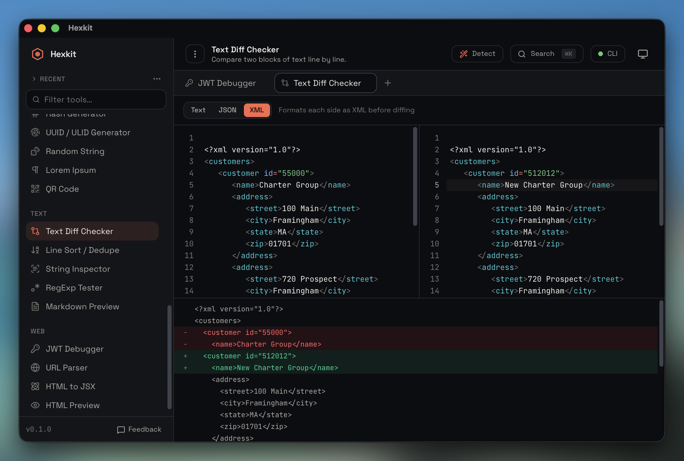

# Hexkit

<p align="center">
  
</p>

A fast, **offline** developer toolbox for macOS, Windows, and Linux — ~40 everyday
encoding, formatting, conversion, and inspection tools in one keyboard-driven app.
Everything runs locally; nothing you paste ever leaves your machine.

Built with **Tauri** (Rust core + system WebView) and **React 19**. All tool logic
lives in a pure Rust crate, so the same engine powers the desktop app, a headless
CLI, and `hexkit://` deep links.

> **License:** PolyForm Noncommercial 1.0.0 — free for personal and other
> non-commercial use. Commercial use requires a paid license. See
> [License & commercial use](#license--commercial-use).

---

## Demo

Browse every Hexkit tool with annotated screenshots at
**<https://hexkit.apps.trinvh.com/demo>** — no install needed. The
sidebar mirrors the desktop app's categories; scroll-spy keeps the
list in sync as you scan.

For the real thing, [download an installer](https://github.com/trinvh/hexkit/releases)
or [build from source](#getting-started). Everything stays on your
machine — the demo page is just the screenshots.

## Highlights

- **100% offline** — all processing happens in local Rust; no network calls.
- **Command palette** (⌘K) and a filterable sidebar to reach any tool instantly.
- **Smart Detection** — detects the right tool from your clipboard contents.
- **Distraction-free View menu** — toggle the sidebar (⌘/Ctrl+B) and header bar
  (⌘/Ctrl+Shift+B) to maximize the content area. Native menu bar on macOS,
  Windows and Linux.
- **Syntax highlighting** on inputs and outputs (CodeMirror 6).
- **Pinned & recently-used** tools above the sidebar filter.
- **Light & dark** themes, both designed intentionally.
- **Multi-tab workspace** — open tools (even the same tool) in separate tabs,
  with per-tab state that persists across restarts.\*
- Headless **CLI** (`hexkit`) and **deep-link** dispatch for future integrations.

\* Some advanced capabilities are planned to require a paid license — see below.

## Tools

**Formatters** — JSON format/validate (with JSONPath filter & sort keys), SQL,
CSS/SCSS/Less, HTML, XML (with XPath filter), JS minify.

**Encoders** — Base64 string, URL encode/decode, HTML entities, Hex/ASCII,
backslash escape, X.509 certificate decoder, Base64 image, Luhn check,
BER-TLV / EMV decoder.

**Converters** — Unix time, number base (2–36), string case, color
(HEX/RGB(A)/HSL(A)/HSB/HWB/CMYK), cron parser, YAML↔JSON, CSV↔JSON, PHP↔JSON,
SVG→CSS, HTML→JSX, cURL→code, JSON→code.

**Generators** — hashes (MD5/SHA-1/256/512 + HMAC), UUID/ULID/Nano ID, random
string, Lorem Ipsum, QR code, test credit card numbers (Luhn-valid, Visa /
Mastercard / Amex / Discover / JCB / Diners / UnionPay).

**Cryptography** — OpenPGP keypair generation (Ed25519 + Curve25519,
ASCII-armored), encrypt, decrypt, sign, verify, encrypt-and-sign,
decrypt-and-verify. Pure-Rust (rpgp), GnuPG-interoperable, fully offline.

> _Tool-spotlight screenshots: only **Text Diff Checker** is shown above —
> dedicated screenshots for the other tools are not yet available._

**Text** — diff checker (text/JSON/XML), line sort/dedupe, string inspector,
RegExp tester (with substitution).

**Web** — JWT debugger (decode + HS256/384/512 verify), URL parser, HTML preview,
Markdown preview, HTTP client (import a curl command, edit headers/query/body,
send the request and inspect the response).

> The **HTTP client** is the one tool that deliberately makes network requests —
> the single exception to Hexkit's offline design, marked with a badge in the
> app. The request runs from the Rust backend, so sending works only in the
> desktop app; the curl import/export (`httpreq.*`) is pure and offline.

## Getting started

### Prerequisites

- [Node.js](https://nodejs.org) 20+ and [pnpm](https://pnpm.io)
- [Rust](https://rustup.rs) (stable)
- Tauri OS prerequisites — see the
  [Tauri setup guide](https://v2.tauri.app/start/prerequisites/)

### Run the desktop app

```bash
pnpm install
make dev          # or: pnpm tauri dev
```

### Common tasks (see the `Makefile`)

```bash
make web          # frontend only, in a browser
make build        # production frontend bundle
make bundle       # build the distributable desktop app
make cli          # build the headless `hexkit` CLI
make test         # Rust + frontend test suites
make check        # typecheck + lint (clippy) + tests + build
```

## The `hexkit` CLI

Every tool also runs headless via the `hexkit` binary, over the exact same
dispatcher the desktop app and `hexkit://` deep links use. Install it once
from inside the app (**Hexkit → Install Command Line Tools…**) or build it
yourself:

```bash
cargo install --git https://github.com/trinvh/hexkit hexkit-cli
# → ~/.cargo/bin/hexkit
```

### Calling convention

```
hexkit <action> '<json-params>'
echo '<json-params>' | hexkit <action>
hexkit 'hexkit://<action>?key=value'
```

- Actions are namespaced `<tool>.<verb>` (e.g. `json.format`, `jwt.decode`).
- Params are a JSON object; string-shaped results print raw, object/array
  results print as pretty JSON.
- The deep-link form takes URL-encoded params and is what
  `hexkit://…` links from your browser, Raycast, or shell hand off to.

### Cheatsheet

```bash
# Format JSON (with optional indent + key sort)
hexkit json.format '{"input":"{\"b\":2,\"a\":1}","indent":"  ","sort":true}'

# JSONPath query
hexkit json.query '{"input":"{\"users\":[{\"id\":1},{\"id\":2}]}","path":"$.users[*].id"}'

# Base64
hexkit base64.encode '{"input":"hello"}'
echo aGVsbG8= | hexkit base64.decode

# URL encode / decode (deep-link form, handy in scripts)
hexkit 'hexkit://url.encode?input=hello world'

# Hash digests (single call returns md5/sha1/sha256/sha512)
hexkit hash.generate '{"input":"hello"}'

# HMAC
hexkit hash.hmac '{"algorithm":"sha256","key":"secret","message":"hi"}'

# JWT inspect (header + payload + algorithm + signature)
hexkit jwt.decode '{"input":"eyJhbGciOi…"}'

# UUID v4 (or ulid, nano_id) — `count` and `lowercased` are optional
hexkit uuid.generate '{"kind":"uuid_v4","count":3}'

# Luhn validate + propose a corrected check digit
hexkit luhn.check '{"input":"4111 1111 1111 1112"}'

# Generate Luhn-valid TEST card numbers
hexkit card.generate '{"brand":"visa","count":3}'

# BER-TLV / EMV chip data
hexkit tlv.decode '{"input":"6F2A840E315041592E5359532E4444463031A5..."}'

# Unix time ↔ ISO
hexkit time.convert '{"input":"1700000000","unit":"auto"}'

# Number base conversion (binary / octal / decimal / hex / custom)
hexkit number.all '{"input":"255","base":10}'

# Pretty-print, query and beautify XML / SQL / CSS
hexkit xml.format  '{"input":"<a><b/></a>"}'
hexkit sql.format  '{"input":"select * from users where id=1"}'
hexkit css.beautify '{"input":".a{color:red}","syntax":"css"}'

# OpenPGP — keygen, encrypt, decrypt, sign, verify (all ASCII-armored)
hexkit pgp.keygen        '{"user_id":"Alice <alice@hexkit.app>","passphrase":""}'
hexkit pgp.encrypt       '{"input":"secret","public_key":"-----BEGIN PGP PUBLIC KEY BLOCK-----…"}'
hexkit pgp.decrypt       '{"input":"-----BEGIN PGP MESSAGE-----…","private_key":"…","passphrase":""}'
hexkit pgp.sign          '{"input":"doc text","private_key":"…","passphrase":""}'
hexkit pgp.verify        '{"input":"doc text","signature":"-----BEGIN PGP SIGNATURE-----…","public_key":"…"}'
hexkit pgp.encrypt_sign  '{"input":"…","public_key":"…","private_key":"…","passphrase":""}'
hexkit pgp.decrypt_verify '{"input":"-----BEGIN PGP MESSAGE-----…","private_key":"…","passphrase":"","public_key":"…"}'

# HTTP client request modelling (pure/offline — actually sending is desktop-only)
hexkit httpreq.from_curl '{"command":"curl -X POST https://api.example.com -d {}"}'
hexkit httpreq.to_curl '{"method":"GET","url":"https://api.example.com","query":[{"key":"q","value":"rust","enabled":true}],"headers":[],"body":{"type":"none"}}'
```

### Discoverability

- Run `hexkit --help` for usage.
- The full action list is the `match` in
  [`crates/devtools-core/src/actions.rs`](crates/devtools-core/src/actions.rs);
  every namespace there is a callable namespace from the CLI.
- Anything you can copy as a "Deep link" from the in-app context menu can be
  pasted as `hexkit '…'` and produces the same result.

## MCP server (for AI agents)

`hexkit-mcp` is a [Model Context Protocol](https://modelcontextprotocol.io)
server that lets an LLM agent (Claude Desktop, Cursor, Cline, …) call a
**curated** subset of Hexkit's tools — the deterministic, spec-heavy ones an
LLM is unreliable at on its own. Everything still runs locally through the same
`devtools-core` dispatcher; nothing is uploaded.

It deliberately exposes a **small** tool set (so it stays cheap on the agent's
context window) rather than all ~55 tools:

| Tool | What it does |
| --- | --- |
| `jwt_decode`, `jwt_verify` | Decode a JWT; verify an HS256/384/512 signature |
| `hash`, `hmac` | MD5/SHA-1/SHA-256/SHA-512 digests; keyed HMAC |
| `pgp_keygen`, `pgp_encrypt`, `pgp_decrypt`, `pgp_sign`, `pgp_verify` | OpenPGP (Ed25519/Curve25519) |
| `x509_decode` | Decode a PEM/DER X.509 certificate |
| `tlv_decode` | Parse BER-TLV / EMV chip-card data |
| `cron_parse` | Explain a cron expression |
| `id_generate` | Generate UUID v4/v7, ULID or Nano ID |

Trivial transforms an agent already does well (JSON formatting, base64, case
conversion, …) are intentionally omitted.

There are two ways to connect, depending on what your client supports.

### Option A — from inside the app (Streamable HTTP)

Open **View → Settings…** and turn on **MCP server** (off by default). Hexkit
then hosts the tools on a loopback port (default `7676`) for as long as the app
is running. Point any client that supports a local MCP **URL** — Claude Code,
Cursor, Cline, Continue — at it:

```json
{
  "mcpServers": {
    "hexkit": {
      "type": "http",
      "url": "http://127.0.0.1:7676/mcp"
    }
  }
}
```

The `"type": "http"` field is required by clients like Claude Code and Cursor to
recognise it as an HTTP (Streamable-HTTP) server. The Settings panel shows the
live status and this copy-paste block. The listener is bound to `127.0.0.1` only
(loopback); nothing is exposed off-machine.

> **Claude Desktop note:** its *Add custom connector* dialog only accepts remote
> **`https://`** URLs, so it rejects `http://127.0.0.1` (the field turns red).
> Use **Option B (stdio)** below for Claude Desktop instead.

### Option B — standalone binary (stdio)

For clients that launch servers over stdio (e.g. Claude Desktop), build the
`hexkit-mcp` binary and point the client's `command` at it:

```bash
# Build the server binary (debug or --release)
cargo build --release -p hexkit-mcp     # → target/release/hexkit-mcp

# Or install it onto your PATH
cargo install --path crates/hexkit-mcp  # → ~/.cargo/bin/hexkit-mcp
```

```json
{
  "mcpServers": {
    "hexkit": { "command": "/absolute/path/to/hexkit-mcp" }
  }
}
```

No arguments, no environment, no network — the server only computes locally.

## Architecture

```
crates/devtools-core/   Pure, Tauri-independent tool logic (one module per tool)
crates/hexkit-cli/      Headless `hexkit` binary over the same dispatcher
crates/hexkit-mcp/      MCP (stdio) server exposing a curated tool subset to agents
src-tauri/              Tauri shell (run_action command, clipboard, deep link)
src/                    React UI (tool registry, shared primitives, per-tool views)
```

Every tool exposes a uniform `run(action, params) -> Result<Value, ToolError>`
function. The desktop app, the CLI, and `hexkit://` deep links all route through
the same dispatcher, so behavior is identical everywhere.

## Tech stack

Tauri 2 · Rust · React 19 · TypeScript · Vite · Tailwind CSS v4 · Zustand ·
CodeMirror 6 · Vitest.

## License & commercial use

Hexkit is **source-available**, not OSI "open source": it is licensed under the
[PolyForm Noncommercial License 1.0.0](./LICENSE).

- ✅ **Free** for any non-commercial purpose — personal use, hobby projects,
  study, research, education, and non-profit/charitable organizations.
- 💼 **A paid commercial license is required** for any commercial use.
- 🔒 Certain advanced capabilities (a planned **Raycast extension** and some
  power-user features such as multi-tab workflows) are intended to require a
  paid license in the future.

For commercial licensing, please open an issue to get in touch.

Third-party dependencies retain their own licenses (mostly MIT/Apache-2.0).

## Contributing

Contributions are welcome — see [CONTRIBUTING.md](./CONTRIBUTING.md). By
contributing you agree your contributions are licensed under the project license.

## Acknowledgements

Built on the work of the Tauri, React, CodeMirror, and the broader Rust and
TypeScript communities.
